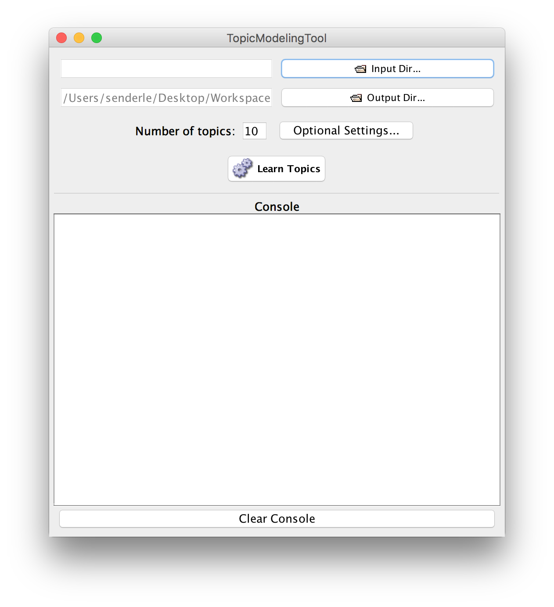
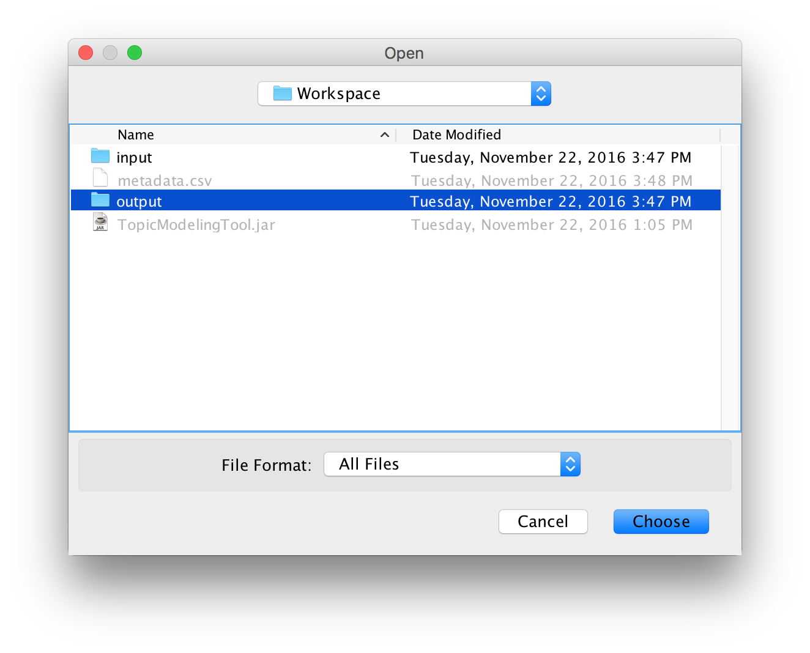

# Topic Modeling Tool
### A GUI for MALLET's implementation of LDA.
#### New features:

* **Metadata integration**
* **Customizable CSV delimiters**
* **Alpha/Beta optimization**
* **Custom regex tokenization**
* **Multicore processor support**

### Getting started:

If you're familiar with the basic idea behind topic modeling, using the tool isn't difficult. However, you may want to read some background material on topic modeling if you're not quite sure how it works. Miriam Posner and Andy Wallace's [Very basic strategies for interpreting results from the Topic Modeling Tool](http://miriamposner.com/blog/very-basic-strategies-for-interpreting-results-from-the-topic-modeling-tool/) is a great starting point for people who think best by doing. Ted Underwood's [Topic modeling made just simple enough](https://tedunderwood.com/2012/04/07/topic-modeling-made-just-simple-enough/) provides a slightly more theoretical -- but still very accessible -- introduction.

#### Install Java

If you don't have a recent version of Java, you will need to install one or update your existing installation. (In particular, older Macs may have very out-of-date versions of Java that this tool no loner supports.) To install Java, follow the instructions for your operating system [here](https://java.com/en/download/help/download_options.xml).

#### Set up your workspace

We recommend starting with an organized workspace containing just the following directories and files. You may use any names you like, but we've chosen simple ones here for the sake of clarity:

  * **Workspace Directory**
  
    * **`input`** (directory)
      
      This directory will contain all the text files you'd like to train your model on. Each text file will correspond to one document. If you want to control what counts as a "document," you may split or join these files together as you see fit. The text files should all be at the same level of the directory hierarchy. Although you may want to remove HTML tags or other non-textual data, the Topic Modeling Tool will take care of most other preprocessing work.
      
    * **`output`** (directory)
      
      This directory will contain the output that the Topic Modeling Tool generates. The tool generates several directories and temporary files; this ensures they don't clutter up your workspace. If the tool runs successfully, you will see only two directories here when it's done: `output_csv` and `output_html`. We'll talk more about their contents later. If the tool fails, there may be other files here, but it's safe to delete all of them before trying again.
      
    * **`TopicModelingTool.jar`** (file; may be downloaded [here](https://github.com/senderle/topic-modeling-tool/raw/master/TopicModelingTool.jar))
      
      This is the tool itself. Once you have Java installed correctly, you will double-click on this to start using it. If you have a Mac, you may need to press control while double-clicking, and then select "Open" to bypass the default security restrictions.
      
    * **`metadata.csv`** (file; optional)
    
      This file is optional, but if it is present, the Topic Modeling Tool will join its own output together with the data in it. This will allow you to make use of some powerful visualization tools almost immediately. This is one of the biggest changes to the tool, and it's worth making use of! It does, however, add some complexity to the tool, and so we ask that metadata files follow these three simple rules: 
      
      **1)** The first line of the file *must* be a header, and following lines *must* all be data. 
      
      **2)** The first column *must* consist of filenames exactly as they appear in the `input` directory. The tool treats filenames as unique identifiers, and matches the names as listed in the metadata file to the names as they apear in the directory itself. Even subtle differences **will cause errors**, so take care here -- if something goes wrong, double-check file extensions, capitalization, and other easy-to-miss differences. 
      
      **3)** This must be a strictly-formatted CSV file. Every row should have the same number of cells, and there should be no blank rows. If you want to have notes, put them in a dedicated column. Be certain that cells with delimiters inside them are double-quoted, and that double-quotes inside cells are themselves doubled. So for example, a cell that contains the string `"You were kind of snippy in this part," he said.` will need to look like this: `"""You were kind of snippy in this part,"" he said."` We've tried to follow [this specification](https://tools.ietf.org/html/rfc4180) carefully, and we even do our best to massage non-compliant data, but unfortunately we can't cover every possible version of the CSV "standard."
      
      **NOTE for Excel users with Apple computers**: If you try to read a CSV saved with Excel on a Mac, the Topic Modeling Tool will currently choke on it. Excel's support for character encodings is [mind bogglingly obsolete](http://stackoverflow.com/q/4221176/577088). We're working on writing something that can handle unexpected Latin-1-encoded data, but for now, we recommend that you import your CSV into Google Sheets and export it back out as a CSV.

#### Run the tool

Once you have your workspace set up, double-click the `TopicModelingTool.jar` file. A window should appear that looks roughly like this:

Recall that Mac users may need to hold control while double-clicking and select "Open." If that doesn't work, your version of Java may not be sufficiently up-to-date.

Next, select the input folder:

Then the output folder:

And the metadata file:

Finally, you'll probably want to adjust the number of topics:

For more information on the other options, you might take a look at the [MALLET](http://mallet.cs.umass.edu/) documentation. Most of the settings will be passed straight on to MALLET; the others, such as the CSV delimiter options, should be fairly straightforward. We hope to create some more thoroguh documentation, but in the meanwhile, we hope this is helpful!

--

This version of the tool was forked from the [original version](http://code.google.com/p/topic-modeling-tool) by [David Newman](http://www.ics.uci.edu/~newman/) and [Arun Balagopalan](https://github.com/arunbg).

Previous work on the GUI for MALLET has been supported by a National Leadership Grant (LG-06-08-0057-08) from the Institute of Museum and Library Services to Yale University, the University of Michigan, and the University of California, Irvine. The Institute of Museum and Library Services is the primary source of federal support for the nation's 123,000 libraries and 17,500 museums. The Institute's mission is to create strong libraries and museums that connect people to information and ideas.
